<div align="center">

# ⛏️ Predicción de Peligro Sísmico en Minas de Carbón

**¿Habrá un evento sísmico peligroso en el próximo turno? Clasificación con datos reales de monitoreo de una mina de carbón.**

Proceso completo de Machine Learning sobre el dataset seismic-bumps: análisis exploratorio, limpieza, selección de rasgos, comparación de 12 clasificadores con 4 estrategias de balanceo y publicación del mejor modelo en una app web con Gradio.


</div>

---

## Tabla de contenido

1. [Descripción del proyecto](#descripción-del-proyecto)
2. [Equipo](#equipo)
3. [El problema](#el-problema)
4. [Dataset](#dataset)
5. [Pipeline de Machine Learning](#pipeline-de-machine-learning)
6. [Modelos y estrategias de balanceo](#modelos-y-estrategias-de-balanceo)
7. [Estructura del repositorio](#estructura-del-repositorio)
8. [Stack tecnológico](#stack-tecnológico)
9. [Decisiones técnicas](#decisiones-técnicas)
10. [Puesta en marcha en local (recomendado)](#puesta-en-marcha-en-local-recomendado)
11. [Ejecución en Google Colab](#ejecución-en-google-colab)
12. [App web](#app-web)
13. [Resultados](#resultados)
14. [Trabajo con agentes de IA](#trabajo-con-agentes-de-ia)
15. [Solución de problemas](#solución-de-problemas)
16. [Limitaciones conocidas](#limitaciones-conocidas)
17. [Mejoras futuras](#mejoras-futuras)
18. [Referencias](#referencias)

---

## Descripción del proyecto

En las minas de carbón subterráneas, el peligro sísmico es de los riesgos más difíciles de anticipar: la roca acumula tensión y puede liberarla de golpe en sacudidas de alta energía capaces de causar derrumbes. Las minas tienen geófonos y sistemas de monitoreo que registran la actividad sísmica, pero convertir esas mediciones en una alerta confiable sigue siendo un problema abierto.

Este proyecto usa las mediciones de un turno de trabajo (8 horas) para predecir si en el **turno siguiente** ocurrirá un evento sísmico de alta energía (más de 10⁴ J). El reto central es el desbalance: solo cerca del **6,6%** de los turnos son peligrosos. Un modelo que diga siempre "sin peligro" acierta el 93% de las veces y aun así no sirve para nada. Por eso comparamos **12 clasificadores** con **4 estrategias de balanceo** y usamos el **F1 de la clase peligrosa** como métrica principal.

Proyecto final de **Fundamentos de Inteligencia Artificial** — Universidad EIA, 2026-2.

## Equipo

| Integrante | GitHub |
| :--- | :--- |
| Juan Jose Jaramillo Mora | [@Juanjo1414](https://github.com/Juanjo1414) |
| Sebastian Giraldo Franco | [@sebasgiraldo69](https://github.com/sebasgiraldo69) |
| Martin Restrepo | [@martinrestrepoc](https://github.com/martinrestrepoc) |
| Miguel Angel Zuleta | [@miguel142434](https://github.com/miguel142434) |
| Julian Mora | [@julian95mora25](https://github.com/julian95mora25) |
| Santiago Zuluaga | [@santiago-zuluaga](https://github.com/santiago-zuluaga) |

## El problema

| Aspecto | Detalle |
| :--- | :--- |
| Tipo de tarea | Clasificación binaria supervisada |
| Entrada | 18 variables del turno anterior: evaluaciones de peligro, energía y pulsos del geófono más activo, número de sacudidas por rango de energía, energía total y máxima |
| Salida | `class`: 1 = turno peligroso, 0 = sin peligro |
| Desbalance | ~6,6% de turnos peligrosos (170 de ~2.584) |
| Métrica principal | F1 de la clase peligrosa |
| Métricas secundarias | Recall, precisión, ROC AUC y accuracy (solo como referencia) |

## Dataset

**seismic-bumps** — datos de dos tajos largos de una mina de carbón en Polonia, donados al UCI Machine Learning Repository por Marek Sikora y Łukasz Wróbel. Cada fila resume la actividad sísmica de un turno de 8 horas.

| Columna | Descripción | Tipo |
| :--- | :--- | :--- |
| `seismic` | Evaluación de peligro del turno por el método sísmico (a = sin peligro, b = bajo, c = alto, d = estado de peligro) | Categórica ordinal |
| `seismoacoustic` | Evaluación de peligro del turno por el método sismoacústico | Categórica ordinal |
| `shift` | Tipo de turno: W = extracción de carbón, N = preparación | Categórica binaria |
| `genergy` | Energía sísmica registrada por el geófono más activo (GMax) | Numérica |
| `gpuls` | Número de pulsos registrados por GMax | Numérica |
| `gdenergy` | Desviación de la energía de GMax frente al promedio de los 8 turnos anteriores | Numérica |
| `gdpuls` | Desviación de los pulsos de GMax frente al promedio de los 8 turnos anteriores | Numérica |
| `ghazard` | Evaluación sismoacústica basada solo en GMax | Categórica ordinal |
| `nbumps` | Número de sacudidas sísmicas en el turno anterior | Numérica |
| `nbumps2` … `nbumps5` | Sacudidas por rango de energía (10² a 10⁶ J) | Numérica |
| `nbumps6`, `nbumps7`, `nbumps89` | Sacudidas de energía muy alta (10⁶ a 10¹⁰ J); valen 0 en todas las filas | Numérica (constante) |
| `energy` | Energía total de las sacudidas del turno anterior | Numérica |
| `maxenergy` | Energía máxima de una sacudida en el turno anterior | Numérica |
| `class` | 1 = hubo un evento de más de 10⁴ J en el turno siguiente | Objetivo |

Fuente: [UCI Machine Learning Repository, id 266](https://archive.ics.uci.edu/dataset/266/seismic+bumps) · Licencia CC BY 4.0 · Archivo original: `data/seismic-bumps.arff`.

## Pipeline de Machine Learning

El trabajo está dividido en cuatro notebooks, cada uno con una sola responsabilidad, y una app que consume el modelo final. Cada notebook guarda los archivos que necesita el siguiente.

```mermaid
flowchart LR
    subgraph Datos["Datos (UCI)"]
        RAW[("seismic-bumps.arff")]
    end

    subgraph NB1["01 · EDA y limpieza"]
        EDA["Análisis exploratorio\nclase · categóricas · numéricas · phik"]
        LIMP["Limpieza\nduplicados · columnas constantes"]
        SPLIT["Codificación ordinal\npartición 80/20 estratificada"]
    end

    subgraph NB2["02 · Escalado, PCA y rasgos"]
        ESC["Escalado\nsin escalar · MinMax · Standard"]
        PCA["PCA\nvarianza acumulada"]
        SEL["Selección de rasgos\nVarianceThreshold · SelectKBest · RFECV\nSFS · L1 · SHAP"]
    end

    subgraph NB3["03 · Balanceo y modelos"]
        CMP["12 modelos × 4 estrategias\nvalidación cruzada 10 particiones"]
    end

    subgraph NB4["04 · Ajuste y exportación"]
        GS["GridSearchCV\ntop 3 combinaciones"]
        UMB["Calibración de probabilidades\numbral de decisión"]
        TEST["Evaluación única\nen el set de prueba"]
    end

    subgraph APP["App"]
        GR["Gradio\nformulario · CSV · métricas"]
    end

    RAW --> EDA --> LIMP --> SPLIT
    SPLIT -- "train.csv · test.csv\nmapeos_categoricas.joblib" --> ESC --> PCA --> SEL
    SEL -- "decisiones_preprocesamiento.joblib" --> CMP
    CMP -- "comparacion_modelos.csv" --> GS --> UMB --> TEST
    TEST -- "modelo_final.joblib\nmetadata_modelo.json" --> GR
```



| Notebook | Qué hace | Genera |
| :--- | :--- | :--- |
| `01_EDA_Limpieza.ipynb` | Carga el ARFF, revisa cada variable y la clase, quita duplicados y columnas constantes, codifica las categóricas y separa train/test | `train.csv`, `test.csv`, `test_original.csv`, `mapeos_categoricas.joblib` |
| `02_Escalado_PCA_Seleccion.ipynb` | Compara escaladores, aplica PCA y compara seis métodos de selección de rasgos | `decisiones_preprocesamiento.joblib`, `comparacion_rasgos.csv` |
| `03_Balanceo_Comparacion_Modelos.ipynb` | Evalúa los 12 modelos con cada estrategia de balanceo usando validación cruzada | `comparacion_modelos.csv` |
| `04_Ajuste_Evaluacion_Exportacion.ipynb` | Ajusta los 3 mejores con GridSearchCV, calibra las probabilidades, elige el umbral, evalúa en test y exporta | `modelo_final.joblib`, `metadata_modelo.json`, `ajuste_hiperparametros.csv` |
| `app.py` | Publica el modelo en una app web | — |

## Modelos y estrategias de balanceo

| Modelos individuales (8) | Ensambles (4) | Estrategias de balanceo (4) |
| :--- | :--- | :--- |
| KNN | Bagging | Sin balanceo |
| Naive Bayes | AdaBoost | `class_weight="balanced"` * |
| Árbol de decisión | Gradient Boosting | SMOTE |
| Regresión logística | Stacking | Submuestreo aleatorio |
| SVM | | |
| SVM lineal | | |
| Red neuronal (MLP) | | |
| Random Forest | | |

\* `class_weight` solo aplica a los modelos que tienen ese parámetro: Árbol de decisión, Regresión logística, SVM, SVM lineal y Random Forest.

## Estructura del repositorio

```text
prediccion-sismica-minas/
├── data/
│   ├── seismic-bumps.arff                 # Original de UCI (no se modifica); es el que usan los notebooks
│   ├── seismic-bumps.csv                  # Copia en CSV de datahub (2.578 filas), solo de referencia
│   ├── train.csv                          # Generado por el notebook 01
│   ├── test.csv                           # Generado por el notebook 01
│   └── test_original.csv                  # Test con las letras originales, para la app
├── models/
│   ├── mapeos_categoricas.joblib          # Notebook 01
│   ├── decisiones_preprocesamiento.joblib # Notebook 02 (escalador y rasgos)
│   ├── modelo_final.joblib                # Notebook 04
│   └── metadata_modelo.json               # Notebook 04 (métricas, umbral, fecha)
├── resultados/                            # Tablas comparativas en CSV
├── figuras/                               # Gráficas para el informe y la presentación
├── informe/
│   ├── informe.html                       # Fuente del informe final (se imprime a PDF desde el navegador)
│   └── Informe_Final.pdf                  # Informe final
├── presentacion/
│   └── presentacion.html                  # Presentación interactiva (se abre en el navegador, sin servidor)
├── referencia/                            # Notebooks de clase usados como guía de estilo
├── 01_EDA_Limpieza.ipynb
├── 02_Escalado_PCA_Seleccion.ipynb
├── 03_Balanceo_Comparacion_Modelos.ipynb
├── 04_Ajuste_Evaluacion_Exportacion.ipynb
├── app.py                                 # App web en Gradio
├── AGENTS.md                              # Reglas del proyecto para personas y agentes de IA
├── CLAUDE.md                              # Puente para Claude Code (importa AGENTS.md)
├── ESTADO.md                              # Avance, decisiones y bitácora
├── PLAN.md                                # Plan de implementación detallado
├── pyproject.toml
├── uv.lock
├── .python-version
└── .gitignore
```

## Stack tecnológico

| Capa | Tecnología |
| :--- | :--- |
| Lenguaje | Python 3.11 |
| Datos y análisis | pandas, NumPy, SciPy (lectura del ARFF) |
| Visualización | Matplotlib, Seaborn, phik (correlación con variables categóricas) |
| Machine Learning | scikit-learn (pipelines, PCA, selección de rasgos, 12 clasificadores, GridSearchCV) |
| Balanceo de clases | imbalanced-learn (SMOTE, RandomUnderSampler, Pipeline) |
| Explicabilidad | SHAP (TreeExplainer) |
| Persistencia del modelo | joblib, JSON |
| App web | Gradio |
| Entorno | uv (`pyproject.toml` + `uv.lock`), Jupyter en VS Code, Google Colab |

## Decisiones técnicas

- **F1 de la clase peligrosa como métrica principal.** Con un 6,6% de positivos, el accuracy premia al modelo que nunca da la alerta. El F1 obliga a encontrar los turnos peligrosos sin llenar de falsas alarmas.
- **Balanceo dentro del pipeline.** SMOTE y el submuestreo van dentro de un `Pipeline` de imbalanced-learn, así se aplican solo a los datos de entrenamiento de cada partición de la validación cruzada. Si se balancea antes de partir, los ejemplos sintéticos se filtran a la validación y los resultados salen inflados.
- **Codificación ordinal de las evaluaciones de peligro.** `seismic`, `seismoacoustic` y `ghazard` van de "sin peligro" a "estado de peligro" (a < b < c < d), así que se codifican como 0 < 1 < 2 < 3 para conservar ese orden. El mismo diccionario se usa en los notebooks y en la app.
- **Valores extremos conservados.** Las energías muy altas son eventos reales y justo lo que queremos anticipar. Quitarlas eliminaría la señal.
- **Columnas constantes eliminadas.** `nbumps6`, `nbumps7` y `nbumps89` valen cero en todos los turnos y no aportan información.
- **Set de prueba reservado.** El 20% de prueba se separa una vez en el notebook 01 y solo se usa al final del notebook 04. Toda la selección de modelos, hiperparámetros y umbral se hace con validación cruzada sobre el 80% de entrenamiento (con la salvedad explicada en la nota de transparencia de Resultados).
- **Calibración de probabilidades.** Como el submuestreo entrena con la mitad de turnos peligrosos, las probabilidades del modelo salen infladas o comprimidas. Se calibran con `CalibratedClassifierCV` (sigmoide) para que la app pueda mostrar un riesgo interpretable. Los hiperparámetros se ajustan con la precisión promedio, que no depende del umbral.
- **Umbral de decisión ajustado.** En vez de usar 0,5 por defecto, el umbral que mejor equilibra F1 se elige con predicciones de validación cruzada sobre train, nunca con test.
- **Pocos rasgos.** La selección de rasgos dejó 5 de los 15 disponibles. Con la regla original del plan quedaba uno solo (`nbumps`), así que se pidió un mínimo de 3 rasgos y que el selector estuviera dentro del pipeline.

## Puesta en marcha en local (recomendado)

Requisitos: Git, Visual Studio Code con las extensiones [Python](https://marketplace.visualstudio.com/items?itemName=ms-python.python) y [Jupyter](https://marketplace.visualstudio.com/items?itemName=ms-toolsai.jupyter), y [uv](https://docs.astral.sh/uv/). No es necesario instalar Python manualmente: uv descarga la versión 3.11 indicada en `.python-version`.

### 1. Instalar uv

```powershell
# Windows (PowerShell)
powershell -ExecutionPolicy ByPass -c "irm https://astral.sh/uv/install.ps1 | iex"
```

```bash
# macOS / Linux
curl -LsSf https://astral.sh/uv/install.sh | sh
```

Cierra y abre la terminal, y verifica con `uv --version`.

### 2. Clonar el repositorio e instalar las dependencias

```bash
git clone <url-del-repositorio>
cd prediccion-sismica-minas
uv sync
```

`uv sync` crea el entorno virtual `.venv` con Python 3.11 e instala exactamente las versiones registradas en `uv.lock`. Verifica con `uv run python --version`.

El dataset (`data/seismic-bumps.arff`) ya viene incluido en el repositorio.

### 3. Seleccionar el kernel en VS Code

Abre la carpeta del proyecto en VS Code, abre `01_EDA_Limpieza.ipynb` y en **Select Kernel → Python Environments** elige el intérprete de `.venv`:

- Windows: `.venv\Scripts\python.exe`
- macOS / Linux: `.venv/bin/python`

### 4. Ejecutar los notebooks en orden

Verifica que la primera celda de cada notebook tenga `EN_COLAB = False` y ejecuta cada uno con **Run All**:

```text
01_EDA_Limpieza → 02_Escalado_PCA_Seleccion → 03_Balanceo_Comparacion_Modelos → 04_Ajuste_Evaluacion_Exportacion
```

El notebook 03 evalúa 41 combinaciones de modelo y balanceo con validación cruzada y el 02 incluye selección de rasgos con SFS y SHAP, así que cada uno tarda unos minutos.

También se pueden ejecutar desde la terminal:

```bash
uv run jupyter nbconvert --to notebook --execute --inplace 01_EDA_Limpieza.ipynb --ExecutePreprocessor.timeout=-1
```

## Ejecución en Google Colab

1. Sube la carpeta del proyecto a Google Drive con el nombre `Proyecto_Sismos`.
2. Abre el notebook en Colab y cambia `EN_COLAB = True` en la primera celda. La celda monta Drive y ajusta las rutas automáticamente.
3. Instala las librerías que Colab no trae por defecto:

```python
!pip install phik shap gradio imbalanced-learn -q
```

## App web

```bash
uv run python app.py
```

La app se abre en `http://127.0.0.1:7860` y tiene tres pestañas:

| Pestaña | Qué hace |
| :--- | :--- |
| **Evaluar un turno** | Formulario con los rasgos que usa el modelo (se arma solo a partir de `metadata_modelo.json`). Muestra el veredicto y un medidor animado con el riesgo estimado en %, el umbral de alerta y el riesgo normal. Los botones **Turno tranquilo**, **Turno en el límite**, **Turno intenso** y **Cargar un turno real al azar** llenan el formulario con turnos reales del set de prueba y muestran también el valor real |
| **Subir un CSV** | Recibe un archivo con las columnas originales del dataset (basta con las que usa el modelo) y devuelve la probabilidad y el veredicto de cada turno |
| **Sobre el modelo** | Modelo elegido, estrategia de balanceo, calibración, rasgos, umbral y tarjetas con las métricas de prueba (y de validación cruzada al lado) |

En Colab, cambia `EN_COLAB = True` dentro de `app.py` y ejecuta `%run app.py` desde la carpeta del proyecto. Gradio genera un enlace público temporal (`*.gradio.live`).

> ⚠️ Proyecto académico. La app no reemplaza los sistemas de monitoreo ni el criterio de los expertos de una mina real.

## Resultados

**Preprocesamiento elegido:** `MinMaxScaler`, sin PCA (no mejoró el F1) y 5 rasgos (`gpuls`, `nbumps`, `nbumps2`, `nbumps3` y `energy`), escogidos con información mutua dentro del pipeline.

**Modelo final:** SVM lineal con submuestreo aleatorio y calibración sigmoide de las probabilidades (`C=0,1`), con umbral de decisión de 0,10.

| Métrica | Validación cruzada (train) | Set de prueba |
| :--- | :--- | :--- |
| F1 clase peligrosa | 0,333 | 0,299 |
| Recall clase peligrosa | 0,537 | 0,471 |
| Precisión clase peligrosa | 0,242 | 0,219 |
| ROC AUC | 0,777 | 0,744 |
| Precisión promedio | 0,206 | 0,192 |
| Brier (referencia: 0,0616) | 0,058 | 0,059 |
| Accuracy | 0,858 | 0,855 |

En el set de prueba el modelo detecta **16 de los 34 turnos peligrosos** y da 57 falsas alarmas entre 482 turnos sin peligro. Un modelo que siempre diga "sin peligro" saca 0,934 de accuracy pero no detecta ninguno (F1 = 0). Sin balancear, los 12 modelos tienen un F1 promedio de 0,090; con balanceo sube a entre 0,234 y 0,250.

Es un problema difícil y el modelo sirve como alerta que ordena los turnos por riesgo, no como un sistema que dé certeza. Las probabilidades están calibradas (en test, la probabilidad media predicha fue 0,067 y la proporción real de turnos peligrosos 0,066), pero ni siquiera el grupo de mayor riesgo pasa de más o menos una de cada cuatro alertas ciertas.

> **Nota de transparencia.** La primera versión del notebook 04 (regresión logística ajustada con F1, F1 en test de 0,296) producía probabilidades pegadas a 0,5 que no servían para la app. La descartamos y la reemplazamos por esta, con ajuste por precisión promedio y calibración. Ese problema lo detectamos con datos de entrenamiento, pero el test de la primera versión ya se había visto, así que el test no es completamente virgen. Todo está explicado en el notebook 04.

## Informe y presentación

- **Informe final:** [`informe/Informe_Final.pdf`](informe/Informe_Final.pdf) (22 páginas). Su fuente es `informe/informe.html`; para regenerar el PDF basta con abrirlo en un navegador basado en Chromium e imprimir a PDF en tamaño A4 sin encabezados.
- **Presentación:** abre `presentacion/presentacion.html` en el navegador. Flechas o espacio para avanzar, `O` para la vista general, `N` para las notas del orador, `T` para el cronómetro y `F` para pantalla completa. Incluye gráficas interactivas con los resultados reales (mapa de las 41 combinaciones, deslizador del umbral) y un simulador que reproduce el modelo final sin servidor.

## Trabajo con agentes de IA

El equipo trabaja con Claude Code, Codex y Antigravity. Para que todos sigan las mismas reglas:

- **`AGENTS.md`** es la fuente única de reglas: estilo de código, comentarios, decisiones tomadas, reglas de datos y forma de trabajar.
- **`CLAUDE.md`** importa `AGENTS.md` para Claude Code, sin duplicar nada.
- **`ESTADO.md`** dice en qué va el proyecto. Quien termine una tarea (persona o agente) lo actualiza.
- **`PLAN.md`** tiene el paso a paso detallado de cada notebook y de la app.

## Solución de problemas

| Problema | Solución |
| :--- | :--- |
| VS Code no muestra `.venv` como kernel | Ejecuta `uv sync` desde la raíz, verifica que las extensiones Python y Jupyter estén habilitadas y usa **Python: Select Interpreter** para elegir `.venv` manualmente. Si no aparece, ejecuta **Developer: Reload Window** |
| `FileNotFoundError` al cargar los datos | Verifica que `data/seismic-bumps.arff` exista y que `EN_COLAB = False` en local |
| `ModuleNotFoundError: imblearn` | El paquete se llama `imbalanced-learn`. En local ejecuta `uv sync`; en Colab, `!pip install imbalanced-learn -q` |
| La app no encuentra el modelo | Ejecuta los cuatro notebooks en orden antes de `app.py` |
| Muchas advertencias de convergencia del MLP o de precisión indefinida | Son esperables con tan pocos positivos; el notebook las explica. No cambian los resultados |
| Falta una dependencia | No uses `pip install` en local. Agrégala con `uv add nombre-del-paquete` y haz commit de `pyproject.toml` y `uv.lock` |

## Limitaciones conocidas

- Los datos vienen de dos tajos de una sola mina en Polonia. El modelo no se puede usar en otra mina sin datos propios de esa mina.
- Con solo 170 turnos peligrosos, el set de prueba tiene unos 34. Cada acierto o fallo mueve bastante las métricas, así que los resultados de prueba se leen junto con la validación cruzada.
- El problema es difícil de por sí: incluso en la literatura los métodos tienen sensibilidad y especificidad lejos de ser perfectas. Un F1 modesto en la clase peligrosa es esperable.
- El modelo predice el riesgo de un evento de alta energía, no un derrumbe ni su ubicación exacta.
- Las filas no traen fecha, así que la partición es aleatoria y no respeta el orden temporal de los turnos.

## Mejoras futuras

- Validación respetando el orden temporal de los turnos, si se consiguen los datos con fecha.
- Ingeniería de rasgos sobre la historia de varios turnos (tendencias de energía y pulsos).
- Validación cruzada anidada para que el ajuste de hiperparámetros y del umbral no sea optimista.
- Costos asimétricos: penalizar más una alerta perdida que una falsa alarma.
- Despliegue permanente de la app en Hugging Face Spaces.

## Referencias

- Sikora, M. & Wróbel, Ł. (2010). *seismic-bumps* [Dataset]. UCI Machine Learning Repository. https://doi.org/10.24432/C5W902
- Sikora, M. & Wróbel, Ł. (2010). Application of rule induction algorithms for analysis of data collected by seismic hazard monitoring systems in coal mines. *Archives of Mining Sciences*, 55(1), 91–114.
- [scikit-learn: documentación oficial](https://scikit-learn.org/stable/)
- [imbalanced-learn: documentación oficial](https://imbalanced-learn.org/stable/)
- [SHAP: documentación oficial](https://shap.readthedocs.io/)
- [Gradio: documentación oficial](https://www.gradio.app/docs)
- [uv: documentación oficial](https://docs.astral.sh/uv/)
